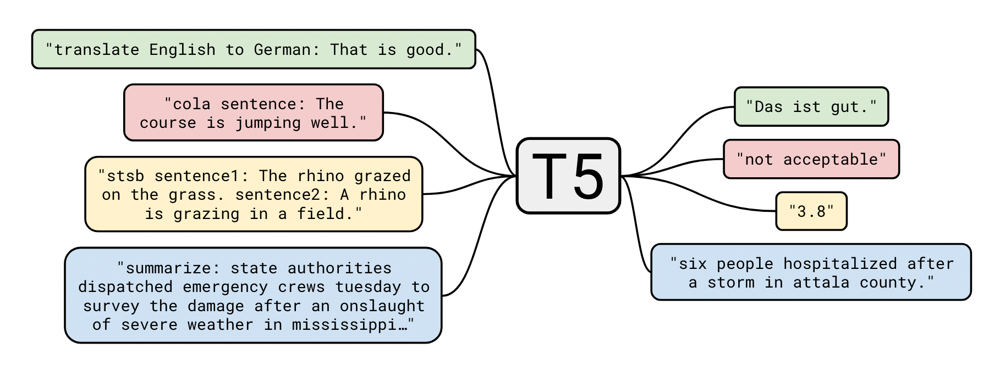
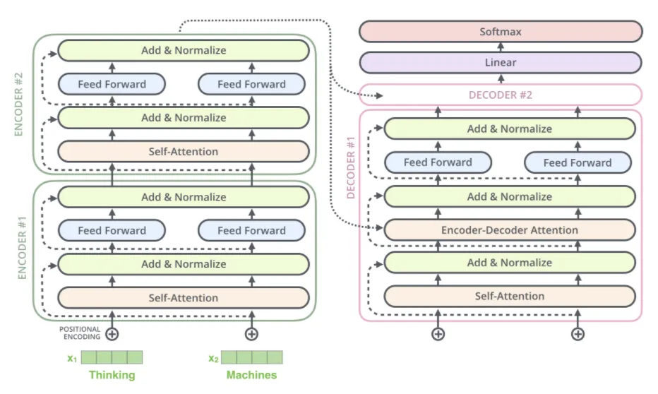

# REBEL - NLP IASD Project

## Getting started

1. Install pyenv + pyenv-virtualenv:

```shell
brew update
brew install pyenv
brew install pyenv-virtualenv
```

2. Add to ~/.bashrc or ~/.zshrc file:

```shell
export PYENV_ROOT="$HOME/.pyenv"
command -v pyenv >/dev/null || export PATH="$PYENV_ROOT/bin:$PATH"
eval "$(pyenv init -)"
eval "$(pyenv virtualenv-init -)"
```

3. Clone the git:

```shell
git clone git@github.com:lucasmrdt/rebel.git
cd rebel
```

4. Create virtualenv with specific python version:

```shell
pyenv install 3.8.16
pyenv virtualenv 3.8.16 rebel
pyenv local rebel
```
NOTE: run the code using `python3.8 <instruction>` or make sure which `python<X.X>` alias is indeed used by the virtual environment.

Or with Conda:
```shell
conda create -n "rebel" python=3.8.16 ipython --file requirements.txt

```
5. Relaunch le shell :
```shell
exec $SHELL
```
6. Install project dependencies:
```shell
pip install -r requirements.txt
pip install datasets==1.3.0 --upgrade
pip install huggingface-hub==0.13.4 # might need to run this to help dependencies to match
```

7. Create symlink
```bash
ln -s `pwd` /tmp/rebel
```

8. Downloading the dataset:
```shell
wget https://osf.io/download/96fpt/\?view_only\=87e7af84c0564bd1b3eadff23e4b7e54 -O rebel_dataset.zip
unzip rebel_dataset.zip
mv data/rebel_dataset/* /tmp/rebel/data/rebel/

```

9. To run training:
```shell
PROTOCOL_BUFFERS_PYTHON_IMPLEMENTATION=python python src/train.py
```


## Transfer learning on T5

T5 [(Exploring Transfer Learning with T5: the Text-To-Text Transfer Transformer)](https://arxiv.org/abs/1910.10683) is a Large Language Model developed by Google and is designed for downstream tasks (as transfer learning for Text2Graph in our case). 
We are focusing on the [small version of T5](https://huggingface.co/t5-small) which consists of 60,000,000 parameters (vs 400,000,000 for the original BART model used in REBEL). It contains 6 encoder T5 attention blocks and 6 decoder T5 attention blocks.

The key idea of T5 is to model tasks as sequence2sequence tasks e.g summarization, translation, regression, question answering, named entity recognition etc. To this extent, T5 looks like a relevant candidate for our REBEL Text2Graph task, even more so knowing that the original writers of REBEL modeled the task as an autoregressive generative task and the output is text where the edges and vertices of the graph are denoted with special tokens.

One of the method used: **gradual unfreezing**

**See thorough descriptions of the model**:
- [Youtube authors presentation](https://www.youtube.com/watch?v=eKqWC577WlI&ab_channel=AllenInstituteforAI)
- [Youtube article summarization](https://www.youtube.com/watch?v=91iLu6OOrwk&ab_channel=TechViz-TheDataScienceGuy)
- [Google Blogpost](https://ai.googleblog.com/2020/02/exploring-transfer-learning-with-t5.html)




### Alternative model: FLAN-T5
FLAN-T5 exists in [small version](https://huggingface.co/google/flan-t5-small). Is the same as T5 but fine tuned on 1800  tasks. 
See [FLAN-T5 article](https://arxiv.org/pdf/2210.11416.pdf)


- [**Useful notebook for finetuning**](https://github.com/philschmid/deep-learning-pytorch-huggingface/blob/main/training/flan-t5-samsum-summarization.ipynb)

- Fine tuning on the whole T5 model: ~26hours/epoch vs 22h when unfreezing last 3 layers (out of 6)
```bash
Epoch 0:   0%|                     | 771/777819 [01:33<26:05:04,  8.27it/s, loss=11.3, v_num=qfci]
```

<!-- Epoch 0:   1%|▏                   | 5099/777819 [10:23<26:15:05,  8.18it/s, loss=3.42, v_num=qfci] -->
--> 1525 minutes for the 777,819 iterations = 25 hours for 1 epoch ! (when not freezing the model)

<!-- Epoch 0:   0%|▏                                         | 3821/777819 [06:26<21:46:13,  9.88it/s, loss=7.67, v_num=m6nq] -->

## Notes/Improvements:

- [ ] the print of the epochs and iterations (~tqdm) might slow the computation ?
- [ ] Freezing the first layers might be optimal for both computation time and will optimize the most high level features.
    - To [freeze layers](https://discuss.huggingface.co/t/do-you-train-all-layers-when-fine-tuning-t5/1034/3) (caveat: our small model hsas 6 blocks and not 12 like T5 large):
    ```python
    for i, m in enumerate(model.decoder.block):        
        #Only un-freeze the last n transformer blocks in the decoder
        if i+1 > 12 - number_layers freeze:
            for parameter in m.parameters():
                parameter.requires_grad = True 
    ```  
    - Added the config `unfreeze_n: 3` at the end of `config/train/default_train.yaml` to select the number of layers that should be unfrozen in t5 decoder
- [ ] At the beginning: prompt from `wandb` to save the logs with an accounts (don't forget to answer the prompt or the training will not start)

